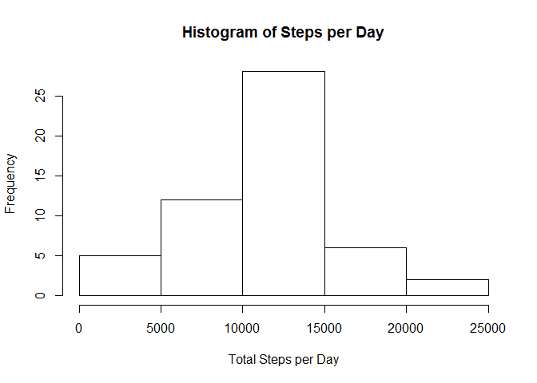
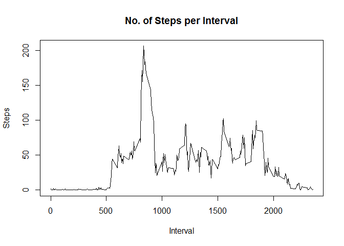

# Reproducible Research: Peer Assessment 1
## Setting all R chunks to echo = TRUE

```r
library(knitr)
opts_chunk$set(echo = TRUE)
```

## Loading and preprocessing the data


```r
activity <- read.csv("D:/Dropbox/Coursera/Data Science Specialization/5. Reproducible Research/Project1/git/RepData_PeerAssessment1/activity.csv", header = TRUE)
```

## What is mean total number of steps taken per day?
1. Calculate the total number of steps taken per day:

```r
steps_per_day <- aggregate(steps~date, data = activity, na.rm = TRUE, FUN = sum)
```

2. Make a histogram of the total number of steps taken each day

```r
hist(steps_per_day$steps, xlab = "Total Steps per Day", main = "Histogram of Steps per Day")
```

<!-- -->

3. Calculate and report the mean and median of the total number of steps taken per day

```r
mean(steps_per_day$steps)
```

```
## [1] 10766.19
```

```r
median(steps_per_day$steps)
```

```
## [1] 10765
```

## What is the average daily activity pattern?
1. Make a time series plot (i.e. type = "l") of the 5-minute interval (x-axis) and the average number of steps taken, averaged across all days (y-axis)


```r
avg_no_of_steps <- aggregate(steps~interval, data = activity, FUN = mean, na.rm = TRUE)
plot(steps~interval, data = avg_no_of_steps, type = "l")
```

<!-- -->

2. Which 5-minute interval, on average across all the days in the dataset, contains the maximum number of steps?

```r
max_steps_interval <- avg_no_of_steps[which.max(avg_no_of_steps$steps),]$interval
```


## Imputing missing values
1. Calculate and report the total number of missing values in the dataset (i.e. the total number of rows with NAs)

```r
sum(!complete.cases(activity))
```

```
## [1] 2304
```

2. Devise a strategy for filling in all of the missing values in the dataset. The strategy does not need to be sophisticated. For example, you could use the mean/median for that day, or the mean for that 5-minute interval, etc.

Using the mean for the 5-minute interval to fill the NAs in "steps" column.


```r
# Create function to calculate mean for 5min interval.
meanOfInterval <- function(interval){
        avg_no_of_steps[avg_no_of_steps$interval == interval,]$steps
}
```


3. Create a new dataset that is equal to the original dataset but with the missing data filled in.


```r
activity_no_na <- activity

for(i in 1:nrow(activity_no_na)){
        if(is.na(activity_no_na[i,]$steps)){
                activity_no_na[i,]$steps <-meanOfInterval(activity_no_na[i,]$interval)
        }
}
```
New dataset with filled NAs was created.


4. Make a histogram of the total number of steps taken each day and Calculate and report the mean and median total number of steps taken per day. Do these values differ from the estimates from the first part of the assignment? What is the impact of imputing missing data on the estimates of the total daily number of steps?


```r
steps_per_day_no_na <- aggregate(steps~date, data = activity_no_na, FUN = sum)
hist(steps_per_day$steps, xlab = "Total Steps per Day", main = "Histogram of Steps per Day with Imputed NAs")
```

<!-- -->

```r
mean(steps_per_day_no_na$steps)
```

```
## [1] 10766.19
```

```r
median(steps_per_day_no_na$steps)
```

```
## [1] 10766.19
```
The mean remains the same. 
The median is slightly higher than before and equals the mean.
The outcome is not surprising since we filled the missing steps with the means of the 5-minute intervals. 


## Are there differences in activity patterns between weekdays and weekends?
1. Create a new factor variable in the dataset with two levels - "weekday" and "weekend" indicating whether a given date is a weekday or weekend day.


```r
dayType <- function(weekday){
        if(as.POSIXlt(weekday)$wday %in% c(0, 6)){
                return("Weekend")}
           
                return("Weekday")
}

activity_no_na$day.type <- as.factor(sapply(activity_no_na$date, dayType))
```

2. Make a panel plot containing a time series plot (i.e. type = "l") of the 5-minute interval (x-axis) and the average number of steps taken, averaged across all weekday days or weekend days (y-axis). See the README file in the GitHub repository to see an example of what this plot should look like using simulated data.

```r
library(lattice)
activity_no_na_plot <- aggregate(steps ~ interval + day.type, data = activity_no_na, FUN = mean)
xyplot(steps~interval | day.type, data = activity_no_na_plot, type = "l", aspect = 1/2, ylab = "Number of Steps", xlab = "Interval")
```

<!-- -->


